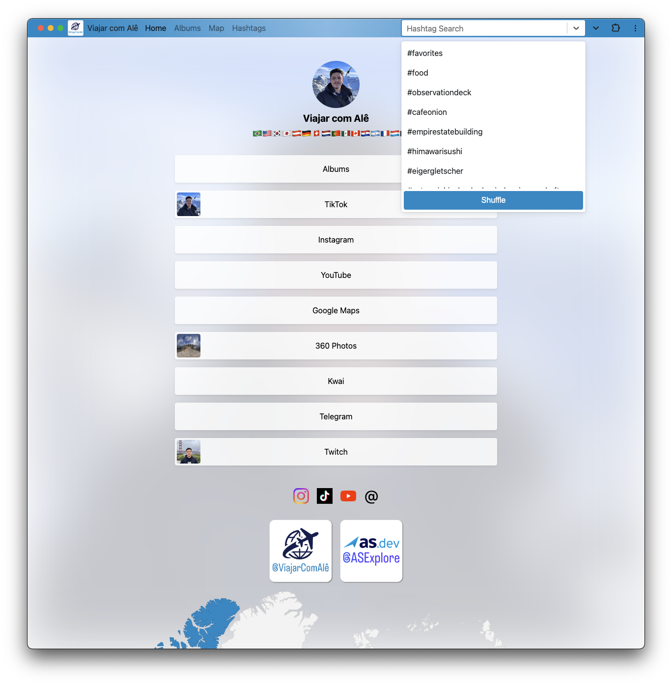

# [viajarcomale.com](https://viajarcomale.com)

This repository contains the code for my travel account Viajar com Alê website [https://viajarcomale.com](https://viajarcomale.com), which intends to be a hub to all my travel social media content, the template is inspired on link in bio platforms using Google Analytics and PWA concepts like:

* Full `manifest.json`
* Service Worker
* Offline access
* Window Control Overlay

Also some search engine optimizations like:

* Web Stories
* Structured Data where possible
* Full sitemap with image and video extensions

You can check the indexed content by searching `site:viajarcomale.com`.

The website is built using Next.js and hosted on Firebase Hosting with full SSR support using Firestore and Firebase Cloud Storage, the Portuguese version (same project with domain comparison) is hosted on [https://viajarcomale.com.br](https://viajarcomale.com.br).

